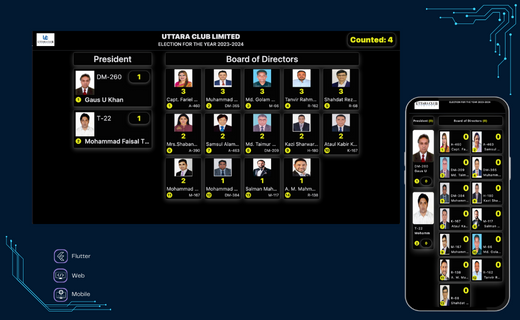
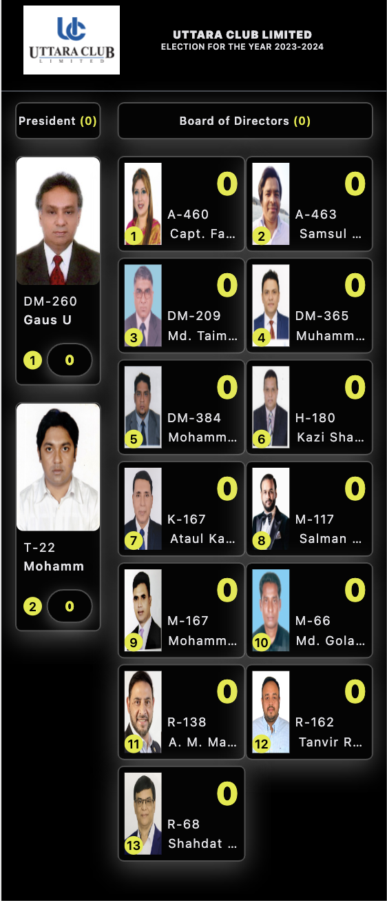

<div align="center">
    <h1>Flutter Responsive Web Presentation for Election</h1>
    
    <h2>Welcome to the Comprehensive Guide to This Flutter Project</h2>
</div>


A Flutter application for publishing and tracking club election results in real-time. This app provides a dynamic platform for clubs to announce election outcomes seamlessly.

***


## Features

- Live update
- Support different screens such as mobile, tab, and desktop screens


### Table of contents
- [System requirements](#system-requirements)
- [Screenshots](#screenshots)
- [Application structure](#application-structure)
- [How to format this code?](#how-to-format-this-code)
- [Libraries and tools used](#libraries-and-tools-used)
- [Authors](#authors)


### System requirements

Dart SDK Version 3.2.0 or higher.
Flutter SDK Version 3.16.0 or higher.


### Screenshots

<div align="center">
    <div>
        
        <p>Figure: Desktop screen of the presentation.</p>
    </div>
    <div>
        
        <p>Figure: Mobile screen of the presentation.</p>
    </div>
</div>

### Application structure

After successful build, your application structure should look like this:

```
.
├── assets                          - It contains all images of our application.
│   └── logo                        - It contains favicon icon
├── lib                             - Most important folder in the application, used to write most of the Dart code..
│   ├── main.dart                   - Starting point of the application
│   └── app.dart                    - This widget is the root of our application
└── test
    └── widget_test.dart            - Test starting point of the application
```

### How to format this code?

- if our code is not formatted then run following command in our terminal to format code
  ```
  dart format .
  ```


### Libraries and tools used

- BLoC - State management
  https://bloclibrary.dev
- equatable: 
- go_router: To navigate between different screens
  https://pub.dev/packages/go_router
- url_strategy:
- get_it:
- cached_network_image - For storing internet image into cache
  https://pub.dev/packages/cached_network_image
- http - To making HTTP requests
  https://pub.dev/packages/http
- stomp_dart_client:


## Authors

- [@shahiduldeowan](https://www.linkedin.com/in/shahiduldeowan/)


